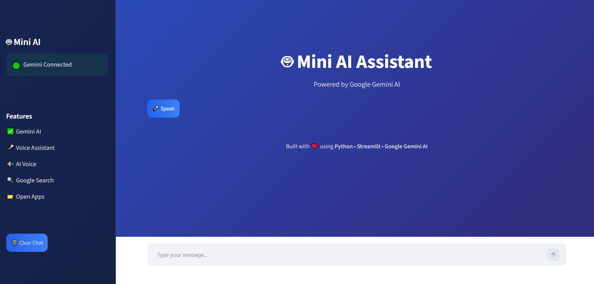
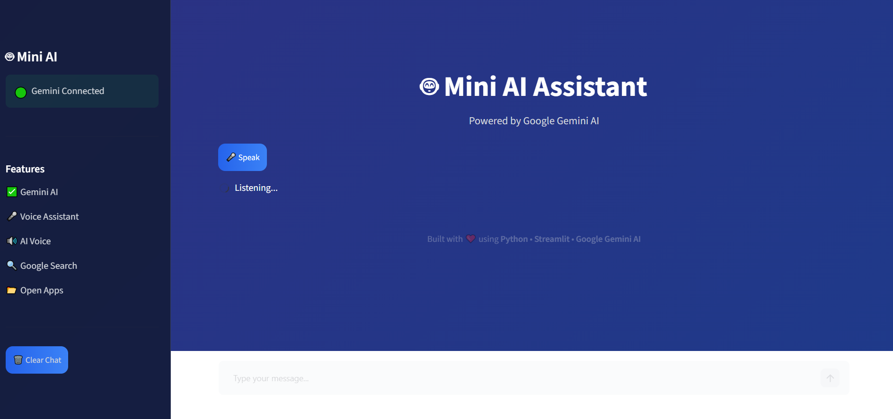
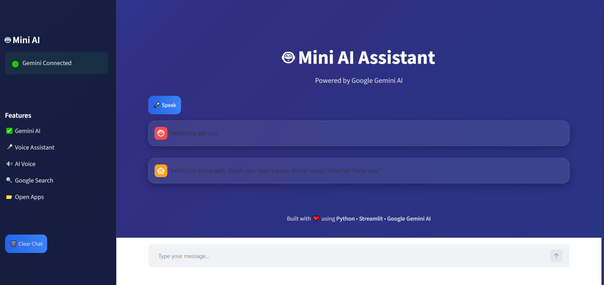
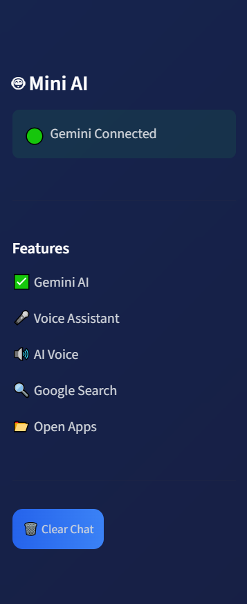

# 🤖 Mini AI Assistant

An AI-powered desktop assistant built with Python, Google Gemini AI, Speech Recognition, Edge-TTS, and Streamlit. It allows users to interact using voice or text, perform basic desktop tasks, and receive AI-generated responses.

---

## ✨ Features

- 🎤 Voice input using Speech Recognition
- 🤖 AI-powered responses with Google Gemini
- 🔊 Natural voice output using Edge-TTS
- 💻 Modern Streamlit user interface
- 🌐 Google Search integration
- 📅 Date and Time assistance
- 😂 Joke generation
- 🚀 Fast and easy to use

---

## 🛠️ Tech Stack

- Python
- Streamlit
- Google Gemini AI
- SpeechRecognition
- Edge-TTS
- Pygame

---

## 📂 Project Structure

```
Mini-AI-Assistant/
│── app.py
│── assistant.py
│── requirements.txt
│── README.md
│── assets/
│── screenshots/
```

---

## 📸 Screenshots

### Home Screen



### Voice Interaction



### AI Response



### Assistant Interface



---

## 🚀 Installation

1. Clone the repository

```bash
git clone https://github.com/SriHariPriya3/Mini-AI-Assistant.git
```

2. Install dependencies

```bash
pip install -r requirements.txt
```

3. Run the application

```bash
streamlit run app.py
```

---

## 👩‍💻 Author

**Rajulapati Sri Hari Priya**

GitHub:
https://github.com/SriHariPriya3

---

⭐ If you like this project, consider giving it a Star!
